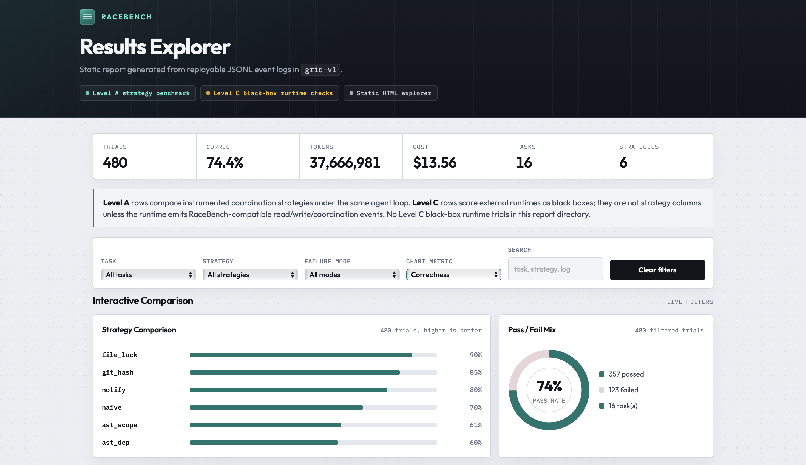
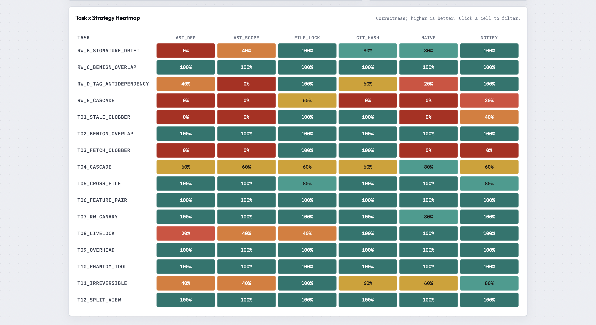

<div align="center">
  <h1>RaceBench</h1>
  <p><strong>A neutral, reproducible benchmark for multi-agent coding coordination strategies.</strong></p>
  <p>
    Parallel LLM coding agents are a shipping product category, but every proposed
    coordination mechanism is still evaluated by its own authors, on its own task
    suite, with its own metrics. Nobody has published the neutral comparison table.
  </p>
  <p>
    RaceBench is that table: a fixed suite of collision-seeded coding tasks, run
    under interchangeable coordination strategies, with per-mechanism cost accounting.
  </p>
  <p>
    
  </p>
  <p>
    
  </p>
</div>

---

## Start here

If you are new to the repo, use this path:

1. Open the 9-strategy static explorer: [`results/grid-v1-plus-extensions/report.html`](results/grid-v1-plus-extensions/report.html)
   (regenerate with `python -m analysis.make_report results/grid-v1 results/grid-v1-extensions --out results/grid-v1-plus-extensions`)
2. Read the practical takeaways: [`docs/coordination-decision-guide.md`](docs/coordination-decision-guide.md)
3. Read the external-runtime boundary: [`docs/external-coordination-protocol.md`](docs/external-coordination-protocol.md)
4. Read the submission write-up: [`writeup/writeup_1000.md`](writeup/writeup_1000.md)
   (long-form claim and limits: [`writeup/writeup.md`](writeup/writeup.md))
5. Optional: baseline-only explorer:
   [`results/grid-v1/report.html`](results/grid-v1/report.html)
6. Run validation locally:

```bash
python -m analysis.validate_logs results/grid-v1 --expect-trials 480
python -m analysis.make_report results/grid-v1
```

## What it measures

| Metric | Why it matters |
|---|---|
| Correctness | hidden oracle test pass rate per trial |
| Wall-clock / total tokens | the price of coordination |
| Wasted-work rate | tokens burned on blocked, conflicted, or failed actions |
| **False-positive stall rate** | coordination triggered on provably-disjoint edits (nobody reports this today) |
| Read-set visibility | fraction of agent reads the coordination layer can observe |
| Event / turn profile | diagnostic counts for LLM calls, tool calls, reads, writes, searches, coordination events, and per-agent activity |

The headline comparison table (Levels A and B below) holds agent tools, tasks, and
event logging fixed and swaps only the coordination mechanism.

## Extensibility

RaceBench has three plug-in levels. **A and B** are the apples-to-apples axis used
for the strategy grid. **C** is separate: it scores a whole external multi-agent
product on the same tasks and oracles.

| Level | What you plug in | Status | Guide |
|---|---|---|---|
| **A: Strategy** | `_coordinate_read` / `_coordinate_write` under our agent loop | Shipped | [`docs/adding-a-strategy.md`](docs/adding-a-strategy.md) |
| **B: Task** | `tasks/<name>/` repo, collision map, hidden oracle | Shipped | `tasks/` layout below |
| **C: External runtime** | Third-party multi-agent system edits the workspace; we score | Shipped (bridge) | [`docs/adding-an-external-runtime.md`](docs/adding-an-external-runtime.md) |

Level C is Terminal-Bench / Harbor-inspired. RaceBench owns the **environment and
verifier**; you bring the agent system. Level C reports correctness and wall
clock only unless your adapter emits RaceBench `read` / `write` / `coord` events.
Do **not** mix Level C cells into the Level A strategy table without filtering.
They answer a different question.

**C1 (harness-swap)** forces fixed RaceBench roles and briefs onto a vendor worker
loop (what `megaagent` and `cursor` do today). **C2
(single-goal emergent)** would give one seed prompt and let the product choose
whether to parallelize; that mode is deliberately unbuilt (see `writeup/writeup.md`
§5). Note that tasks fix named `agent-*` roles so collision maps stay deterministic; C1 therefore measures contested edits under a known split, not open-ended
decomposition or product orchestration.

**Purpose of C1.** RaceBench fixes who does what; the vendor runs each brief with
its own tools and does not use our coordination layer. That is closest to Level A
`naive`, but with a real product worker stack (e.g. Cursor + composer) instead of
our harness. C1 answers a narrow question: on the same tasks and splits, do
seeded races still show up when a shipping agent edits the repo, or were failures
mostly due to our toy tool API? Treat those numbers as **harness vs
harness**, not as a strategy ranking.
Early one-pass smokes (`results/ext-cursor/`) are documented in `writeup/writeup.md`
§5. Details there also cover why strategy rankings stay in Level A.

### Level A: Built-in strategies

All strategies implement the same interface (`harness/strategies/base.py`) and are
labeled "X-style": faithful-but-minimal reimplementations, not the original authors'
systems. RaceBench currently covers **nine coordination mechanism classes**. The
first six make up the committed `grid-v1` baseline; the last three are post-grid
extensions evaluated in targeted and extension runs.

1. `naive`: direct writes, last write wins. The floor.
2. `file_lock`: file-level lock on first touch, held until the agent finishes.
3. `git_hash`: MegaAgent-style optimistic concurrency: record content at read, 3-way
   merge on write, surface conflicts back to the agent.
4. `ast_scope`: symbol-level write claims via Python AST diff (Grit/Phantom/Weave-style,
   see prior art below): two agents editing disjoint functions in the same file never stall.
5. `ast_dep`: `ast_scope` plus a workspace import/use dependency graph: stalls when a
   write races a claimed cross-file definition or use-site.
6. `notify`: CoAgent-lite advisory notifications: writes land immediately; agents whose
   read set intersects a landed write get a notice injected into context and self-judge.
7. `peer_contract`: voluntary mediated peer negotiation. Agents can call
   `declare_intent` before editing and `ack_contract` after receiving an overlap
   notice. Overlapping writes wait for peer ACK; disjoint declared edits can proceed.
8. `peer_broker`: forced mediated peer negotiation. The runtime detects an
   overlapping write, opens a private broker decision with affected peers, and
   applies the write unless peers report a true conflict. Peers can request
   concrete constraints that are cached as obligations, mark the write irrelevant
   to their subtask, or reject the write.
9. `adaptive_lease`: conservative adaptive locking. Precise function/class
   edits get symbol leases, uncertain module/file edits fall back to a file
   lease, semantic resources can be declared or inferred across files, and stale
   whole-file overwrites are refused rather than silently clobbering another
   agent's landed work.

`peer_contract` and `peer_broker` are intentionally separate, like `ast_scope`
and `ast_dep`: they test whether voluntary negotiation is enough, and whether a
runtime-triggered broker is worth the extra turn and token cost.
`adaptive_lease` is a separate hybrid: it asks whether `file_lock` safety can be
kept while recovering some `ast_scope` granularity.

Log note: normal agent turns are positive. `peer_broker` may emit
`llm_usage` with `phase: "broker"` and `turn: -1`, `-2`, etc. Those are private
broker decision calls outside the normal agent tool loop, not negative progress.

**Adding your strategy (Level A).** Implement `_coordinate_read` and
`_coordinate_write`, register with `@register`, import in
`harness/strategies/__init__.py`, add the name to `strategies:` in a runner
config, and smoke-test with `runner/configs/config.smoke.yaml` (scripted agents, no API
key). Strategies can also expose optional strategy-owned tools through
`extra_tool_schemas()` / `handle_strategy_tool(...)`, or use private broker
callbacks through `request_negotiation(...)`.
Full checklist: [`docs/adding-a-strategy.md`](docs/adding-a-strategy.md).

**Out of scope for the hackathon window** (reasons in `writeup/`): full CRDT substrate,
CoAgent's full MTPO with serialization pre-order and saga inverses, 8+ agent scale;
lock-on-write-only `file_lock` and `git_hash`+worktree hybrids (redundant with
`ast_scope` / task-level `isolation: worktree`).

### Level C: External runtimes

```bash
# Offline scripted adapter (no API key)
python -m runner.run_external --task t02_benign_overlap --adapter scripted \
  --out results/ext-smoke

# Your own process
python -m runner.run_external --task t02_benign_overlap --adapter shell \
  --command 'python my_multi_agent.py' --out results/ext-smoke

# MegaAgent vendor bridge (clone + API key in their config.py)
pip install -e '.[megaagent]'
python -m runner.run_external --task t02_benign_overlap --adapter megaagent \
  --megaagent-root /path/to/MegaAgent --out results/ext-megaagent

# Cursor C1 (CURSOR_API_KEY; one Agent.prompt per fixed brief)
pip install -e '.[cursor]'
python -m runner.run_external --task t02_benign_overlap --adapter cursor \
  --out results/ext-cursor
```

Built-in adapters: `scripted`, `shell`, **MegaAgent** (`adapters/megaagent/`,
shared isolation only), and **Cursor** (C1 via `cursor-sdk`, shared + worktree).
Before each trial the harness writes `.racebench_instructions/` (task metadata,
paths, per-agent briefs). Full API and metrics table:
[`docs/adding-an-external-runtime.md`](docs/adding-an-external-runtime.md).

## Tasks (Level B)

Twelve purpose-built mini-repos in `tasks/` (probe suite) plus a **FastAPI
Conduit external-validity track** (`rw_*`). Each has a collision map, hidden
pytest oracle, and reference solution.

| Task | Failure mode | Agents | Notes |
|---|---|---|---|
| `t01_stale_clobber` | stale read / lost update (whole-file rewrite) | 2 | hardened; v1 in `tasks/_archive/` |
| `t02_benign_overlap` | disjoint functions, same file (FP probe) | 2 | `benign: true` |
| `t03_fetch_clobber` | write-write on the same function (whole-fetch rewrite) | 2 | hardened; v1 in `tasks/_archive/` |
| `t04_cascade` | causal cascade across a dependency chain | 4 | multi-module |
| `t05_cross_file` | cross-file symbol dependency | 2 | multi-module |
| `t06_feature_pair` | CooperBench-style feature pair | 2 | multi-module |
| `t07_rw_canary` | antidependency / silent invalidation | 2 | |
| `t08_livelock` | lock wait-cycle / livelock stress | 2 | opposite edit order |
| `t09_overhead` | overhead-masks-benefit (disjoint pkgs) | 2 | `benign: true` |
| `t10_phantom_tool` | tool-registry drift | 2 | needs `list_tools` |
| `t11_irreversible` | external-effect reordering | 2 | `.effects.jsonl` order |
| `t12_split_view` | worktree divergence | 2 | `isolation: worktree` |
| `rw_c_benign_overlap` | benign same-file on Conduit | 2 | FastAPI+SQLite+Pydantic |
| `rw_b_signature_drift` | stale-read / signature drift | 2 | Conduit `format_article` |
| `rw_d_tag_antidependency` | tag filter vs count silent invalidation | 2 | Conduit tags |
| `rw_e_cascade` | 3-agent causal cascade | 3 | Conduit Article.summary |

The Conduit base lives in `tasks/_conduit_base/` (shared source). Host deps
include `fastapi`, `httpx`, and `pydantic`; reinstall with
`pip install -e ".[dev]"` after pull. Oracles use FastAPI `TestClient` (no
live server / Newman / Postgres).

## Tools

Agents get instrumented file tools (`read_file`, `write_file`, `edit_file`,
`list_files`, `run_tests`, `done`) plus `grep` / `glob`. Tasks with a
`registry:` block also expose `list_tools` / `invoke_tool` and irreversible
effect tools (`send_email`, `deploy`, `charge`). Workspace isolation is
`shared` (default) or `worktree` (per-agent trees merged before the oracle).

## Quickstart

```bash
python -m venv .venv && source .venv/bin/activate
pip install -e ".[dev]"

# harness self-test (scripted agents, no API key needed)
pytest

# single trial with scripted agents (offline demo)
python -m runner.run_grid --config runner/configs/config.smoke.yaml

# real grid (needs OPENAI_API_KEY in .env or your shell)
# echo 'OPENAI_API_KEY=sk-...' > .env
python -m runner.run_grid --config runner/configs/config.example.yaml
# optional: override concurrent trials (config default: parallel: 4)
# python -m runner.run_grid --config runner/configs/config.example.yaml --parallel 8

# validate replay logs, then regenerate tables, CI intervals, event profiles, plots, and report.html
python -m analysis.validate_logs results/grid-v1 --expect-trials 480
# optional: treat nested tool-call argument schema drift as validation errors
# python -m analysis.validate_logs results/grid-v1 --expect-trials 480 --strict-tool-args
python -m analysis.make_report results/grid-v1
# optional: pass the runner config that holds prices:
# python -m analysis.make_report results/<run_id> --prices-config runner/configs/config.example.yaml
```

If you do not activate the virtualenv, replace `python` with `.venv/bin/python`.

### Frozen result folders

The frozen submission evidence stays at the top level of `results/`:

| Folder | Role |
|---|---|
| `results/grid-v1/` | Main 6-strategy baseline, 480 trials |
| `results/grid-v1-extensions/` | Three post-grid strategies, 240 trials |
| `results/grid-v1-plus-extensions/` | Combined 9-strategy report, 720 trials |
| `results/grid-v1-calibration/` | Solo-agent calibration |
| `results/grid-v1-agnes-sensitivity/` | Second-provider sensitivity check |
| `results/cross-run-analysis/` | Provider and solo-versus-parallel dashboard |
| `results/ext-cursor/` | Level C Cursor black-box smoke check |
| `results/grid-v1-toolarg-rerun/` | Tool-argument audit rerun |

Older targeted iterations, scripted smoke outputs, and incomplete external
debug runs are archived locally under `results/_archive/nonofficial-runs/`.

### Tool argument audit rerun

Strict tool-argument validation can flag old logs where the model omitted a
required tool field. Do a surgical rerun before deciding whether any headline
claim needs a note or replacement cell. This keeps the original result folders
unchanged and writes only the flagged missing-field cells from `grid-v1` and
`grid-v1-extensions`.

```bash
python -m runner.run_grid --config runner/configs/config.toolarg-rerun.yaml
python -m analysis.validate_logs results/grid-v1-toolarg-rerun \
  --expect-trials 16 --strict-tool-args
python -m analysis.make_report results/grid-v1-toolarg-rerun \
  --prices-config runner/configs/config.toolarg-rerun.yaml
```

The strict validator also reports older `must_preserve` string-vs-array drift in
some peer-contract logs. Those are useful audit warnings, but this minimal rerun
targets missing required fields first because those are most likely to affect
correctness. A strict audit can still print warnings when a malformed model
attempt was followed by `tool_arg_invalid`; that means the runtime rejected the
call before execution and asked the agent to retry.

### Adaptive lease strategy

`adaptive_lease` is an experimental Level A hybrid between `file_lock`,
`ast_scope`, and lightweight semantic-resource claims. It uses symbol leases for
precise edits, falls back to file leases when scope is broad or uncertain, lets
agents call `declare_scope` for resources such as `tag.normalization`, and
refuses stale whole-file overwrites. Use the offline smoke first, then the
targeted live config only if you want a cheap one-rep signal. Historical
targeted logs are archived under `results/_archive/nonofficial-runs/`; rerunning
the config will recreate `results/grid-v1-adaptive-lease-targeted-v2/`.

```bash
python -m runner.run_grid --config runner/configs/config.smoke.yaml
python -m runner.run_grid --config runner/configs/config.adaptive-lease-targeted.yaml
python -m analysis.validate_logs results/grid-v1-adaptive-lease-targeted-v2
python -m analysis.make_report results/grid-v1-adaptive-lease-targeted-v2 \
  --prices-config runner/configs/config.adaptive-lease-targeted.yaml
```

### Peer negotiation strategies

`peer_contract` and `peer_broker` are experimental Level A strategies. Use the
targeted config first because it spends real model tokens and focuses only on
tasks where peer negotiation should matter.

The current target folder keeps the raw run label `v5`, but the docs refer to
that broker refinement as conceptual V2.5 so V3 can remain reserved for the
future external mediation protocol. Historical targeted peer logs are archived
under `results/_archive/nonofficial-runs/`; rerunning the config will recreate
`results/grid-v1-peer-targeted-v5/`.

```bash
python -m runner.run_grid --config runner/configs/config.peer-targeted.yaml
python -m analysis.validate_logs results/grid-v1-peer-targeted-v5
python -m analysis.make_report results/grid-v1-peer-targeted-v5 \
  --prices-config runner/configs/config.peer-targeted.yaml
```

### Extension grid

After the targeted runs look stable, run the three experimental Level A
strategies across the same 16 tasks and 5 reps as `grid-v1`. This keeps the
original baseline folder stable and writes a separate 240-trial extension run.

```bash
python -m runner.run_grid --config runner/configs/config.extensions.yaml
python -m analysis.validate_logs results/grid-v1-extensions --expect-trials 240
python -m analysis.make_report results/grid-v1-extensions \
  --prices-config runner/configs/config.extensions.yaml

# combined 9-strategy explorer, preserving both source result folders
python -m analysis.make_report results/grid-v1 results/grid-v1-extensions \
  --out results/grid-v1-plus-extensions \
  --prices-config runner/configs/config.example.yaml
```

### Agnes model sensitivity

```bash
# second-provider sensitivity check, 144 trials
# echo 'AGNES_API_KEY=sk-...' >> .env
python -m runner.run_grid --config runner/configs/config.agnes-sensitivity.yaml --parallel 1
python -m analysis.validate_logs results/grid-v1-agnes-sensitivity --expect-trials 144
python -m analysis.make_report results/grid-v1-agnes-sensitivity \
  --prices-config runner/configs/config.agnes-sensitivity.yaml

# optional full Agnes grid, 480 trials, only if credits/time allow
python -m runner.run_grid --config runner/configs/config.agnes-full.yaml --parallel 1
python -m analysis.validate_logs results/grid-v1-agnes --expect-trials 480
python -m analysis.make_report results/grid-v1-agnes \
  --prices-config runner/configs/config.agnes-full.yaml
```

Use `results/grid-v1-agnes-sensitivity/` as a model-sensitivity check, not as a
replacement for the Level A OpenAI grid. If the sensitivity ranking agrees with
`grid-v1`, the writeup can claim the main coordination conclusions were checked
against a second OpenAI-compatible model provider. The Agnes run is intentionally
scoped to the baseline/high-signal strategy set. It does not need to rerun
`peer_contract`, `peer_broker`, or `adaptive_lease`, since those are post-grid
exploratory strategies and the marginal value of a second-provider rerun is lower
than finishing the primary analysis.
The Agnes configs include a conservative request-per-minute cap and rerun
temporary provider-error logs so `429` throttles are not counted as benchmark
failures.
The Agnes configs use a published list-rate estimate for analytical cost
comparison (`$0.03 / 1M` input tokens and `$0.15 / 1M` output tokens for
`agnes-2.0-flash`). Actual out-of-pocket spend may be `$0` under hackathon or
free credits, but the reports and dashboards keep that separate from model cost.

### Cross-run analysis

After the Agnes sensitivity run has enough completed logs, compare it against
the OpenAI grid and the solo calibration run:

```bash
python -m analysis.compare_runs \
  --provider-runs results/grid-v1 results/grid-v1-agnes-sensitivity \
  --solo-run results/grid-v1-calibration \
  --parallel-run results/grid-v1 \
  --out results/cross-run-analysis
```

This writes provider/model tables for overlapping Level A cells, plus
solo-versus-parallel tables and a static dashboard at
`results/cross-run-analysis/dashboard.html`. The provider comparison answers
whether strategy rankings are stable across model providers. The solo comparison
answers whether a task fails because of coordination races or because one agent
could not solve the task even without concurrency. The dashboard also exposes
turn and event diagnostics such as LLM calls, tool calls, reads, writes,
searches, coordination events, tokens per turn, and estimated USD per trial.

Direction matters. Provider advantage means the later provider run is compared
against the first provider run. With the command above, that is
`results/grid-v1-agnes-sensitivity` versus `results/grid-v1`. Parallel advantage
means `--parallel-run` versus `--solo-run`, so the command above compares
`results/grid-v1` versus `results/grid-v1-calibration`. The CSV/Markdown tables
include a `direction` column, and the `delta_*` columns should be read as
direction-aware advantage scores, not raw subtraction in every case. For
lower-is-better metrics such as tokens, runtime, and turns, the sign is flipped
before coloring so green means the first named run is better.

`analysis.make_report` also writes `event_profile_by_strategy.*`,
`event_profile_by_task_strategy.*`, and `agent_activity.*`. These tables are
diagnostics: they explain where a result came from by showing event mix, turn
count, and which agent read, wrote, searched, or spent tokens. Keep them
separate from Level C external-runtime comparisons unless the adapter emits the
same RaceBench event schema.

## Repo layout

```
harness/     agent loop, coordination layer, strategies/, event log
tasks/       one dir per task: task.yaml, repo/, oracle_tests/, collision_map.yaml
runner/      grid configs, orchestrator, cost guardrails
analysis/    metrics computation, plots, report notebook
adapters/    Level C vendor bridges (e.g. megaagent/)
docs/        contributor guides (adding-a-strategy, adding-an-external-runtime)
results/     committed JSONL event logs (the reproducibility artifact)
writeup/     five-pillar write-up + demo video script
```

## Prior art and attribution

- CodeCRDT: arXiv:2510.18893 (CRDT coordination; motivates the confound metrics)
- CoAgent / MTPO: arXiv:2606.15376 (notification-based advisory control)
- MegaAgent: arXiv:2408.09955 (git-hash + mutex; basis of `git_hash`)
- Verified Detection of Concurrency Anomalies: arXiv:2606.17182 (failure-mode taxonomy)
- CooperBench: arXiv:2601.13295 (collaborative coding tasks; complementary axis:
  it varies communication, we vary the coordination mechanism)
- Contract Net Protocol: Smith, IEEE Transactions on Computers 1980,
  DOI: https://doi.org/10.1109/TC.1980.1675516
  (classic peer negotiation and task-allocation protocol; background for the
  peer-negotiation framing)
- POANCD: Li, Vo, and Kowalczyk, UAI 2011 / arXiv:1202.3740
  (distributed negotiation over combinatorial domains under incomplete
  information; inspiration for `peer_contract` / `peer_broker`, not directly
  implemented)
- Lock granularity: Gray, Lorie, Putzolu, and Traiger, VLDB 1975,
  https://www.vldb.org/dblp/db/conf/vldb/GrayLPT75.html
  (prior art for locks over resources at different granularities)
- Semantic multigranularity locking: Journal of Systems Architecture 1998,
  DOI: https://doi.org/10.1016/S1383-7621(97)00069-6
  (prior art for using application/object semantics to increase concurrency)
- Adaptive locks: Usui et al., Journal of Parallel and Distributed Computing
  2010, DOI: https://doi.org/10.1016/j.jpdc.2010.02.006
  (prior art for adapting locking behavior to recover concurrency)
- Specification Gap: arXiv:2603.24284, and the tools Grit, Phantom, Weave
  (prior art for AST-level conflict detection; `ast_scope` is our neutral
  reimplementation for measurement, not a novel mechanism)
