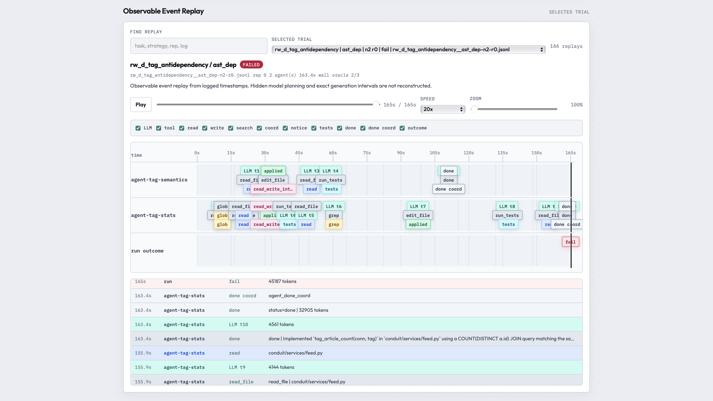
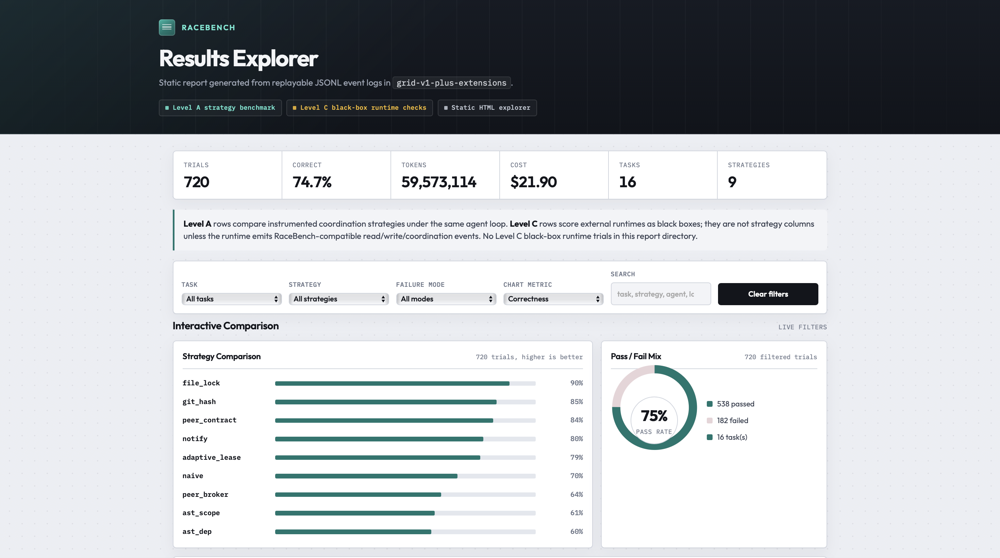
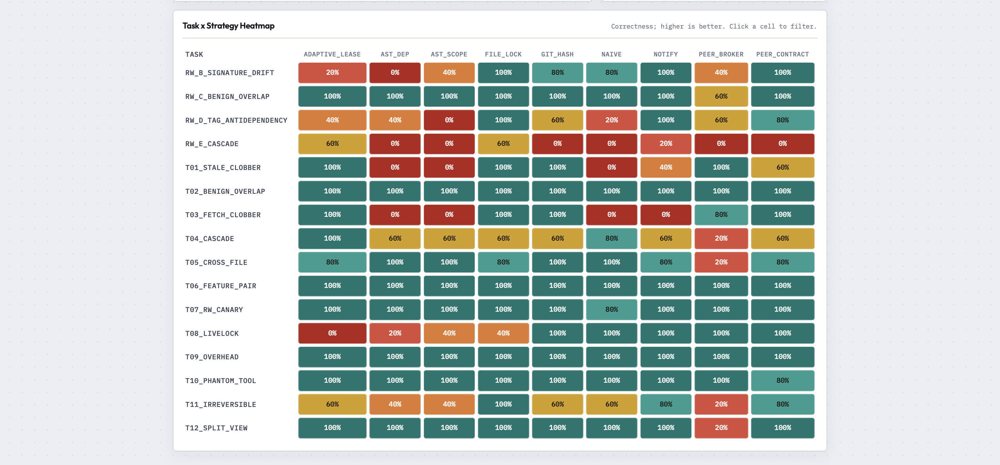
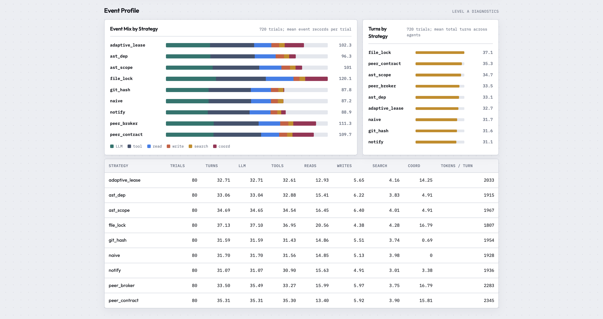

# RaceBench: A Neutral Benchmark for Multi-Agent Coordination

**Agnes note.** I used `agnes-2.0-flash` for a scoped Level A provider-sensitivity check on eight high-signal cells ([details](#cross-run-findings)).

## 1. Problem

Parallel coding agents are easy to launch but hard to trust. When two or more agents edit the same repository, they can clobber each other's work, read stale state, coordinate too much, or waste tokens. Existing proposals usually report gains inside one system or task distribution, making it hard to tell whether the mechanism helped or the product simply gave it easier work.

RaceBench asks: given the same repository, prompts, models, task pairs, and oracles, which coordination policies reduce race failures, and when do they create avoidable stalls? Tasks are seeded for **contention**, not convenience: solo calibration checks whether agents can do the work alone; parallel cells measure what coordination adds. My pre-grid criteria were replay fixed race tasks, compare against naive, report correctness, wall time, tokens, stalls, and false-positive stalls, and preserve auditable logs.

The novelty is measuring overcoordination, not just failures. False-positive stalls, where a strategy blocks safe parallelism, are rarely reported in prior work, but they matter because a safe team that serializes everything is not very useful.

## 2. Approach

RaceBench is a small, instrumented benchmark harness. Each trial runs two to four agents on a seeded coding task. The harness records reads and writes, applies a coordination strategy, runs the oracle, and writes JSONL logs plus aggregate tables. What defines the benchmark is the [task suite](#task-suite): 16 collision-seeded repos with fixed briefs, collision maps, and hidden oracles. The headline grid runs those tasks under 6 Level A strategies (`naive`, `file_lock`, `notify`, `git_hash`, `ast_scope`, `ast_dep`; [catalog](#strategy-catalog)). I then added three post-grid extensions on the same tasks: `adaptive_lease`, `peer_contract`, and `peer_broker` ([iteration notes](#adaptive-lease-iteration)), combining lock safety, notify-style re-reads, semantic granularity, and peer negotiation.

For the headline [Level A](#level-a-to-c) grid, I ruled out auto-merge editors (confounds merge quality) and full saga layers (need inverse operations like undo). I also kept commercial agent stacks off the strategy table: without shared read/write mediation hooks, Cursor or Claude Code mostly measure each product's hidden planner, not a reusable policy. Those runtimes belong in [Level C](#level-a-to-c) as external checks via adapters. Level A keeps fixed task, model, oracle, and prompts so only the coordination mechanism changes.

## 3. Evidence

The main run, `results/grid-v1`, contains 480 replayable trials: 16 tasks, 6 strategies, 5 repetitions. The pooled pass rate was 74.4 percent, with about $13.56 spent and 37.7M tokens recorded ([Figure 1](#figures)). JSONL logs trace reads, writes, stalls, and coordination events to auditable trajectories ([Figure 2](#figures)). Solo calibration passed 96.2 percent ([appendix](#cross-run-findings)), confirming parallel failures measure coordination pressure, not impossible tasks. See the [static HTML explorer](#full-results) for aggregate tables and bootstrap confidence intervals.

On the baseline grid, parallel correctness ranged from 60 percent (`ast_dep`) to 90 percent (`file_lock`), with `git_hash` at 85 percent, `notify` at 80 percent, `naive` at 70 percent, and `ast_scope` at 61 percent. There is no universal winner: `file_lock` leads on hard races but averaged 174s per trial and 0.66 false-positive stalls; `notify` was faster (52s) with zero stalls but weaker on some clobber cells; AST strategies lag overall but expose where coarse locks over-block.

Two patterns drive that spread. On destructive overlap (`t01_stale_clobber`, `t03_fetch_clobber`), `naive` went 0/5 while `file_lock` and `git_hash` went 5/5. On benign overlap (`t02_benign_overlap`), all six strategies pass 5/5, but `file_lock` averages 1.0 false-positive stall per trial while `notify` and `naive` average zero. A strategy can pass tests and still destroy concurrency. Notification also helps stale-read cases (`rw_d_tag_antidependency`: naive 1/5, notify 5/5).

After the baseline grid, I evaluated three extensions on the same 16 tasks (`results/grid-v1-plus-extensions/`; [Figures 3–5](#figures)). `peer_contract` reached 83.8 percent, near `git_hash` and below `file_lock`; `adaptive_lease` reached 78.8 percent with zero false-positive stalls, beating `naive` and both AST rows; `peer_broker` reached 63.8 percent and is best read as a failed ablation on cascade and cross-file cells. Promising hybrids, not a new overall winner. Iteration detail is in the [appendix](#peer-broker-v25-iteration).

## 4. Constraints

The biggest constraint was cost. I kept the grid small and reused the same logs for the final report instead of a larger sweep.

Coordination can also trade throughput for safety. Grid-wide, `file_lock` averaged 174s per trial versus 52s for `notify`, mostly because coarse file locks serialize multi-agent cascade and cross-file work (for example, `t04_cascade`: 562s vs 65s), not because tokens differ much. There are also realism constraints: RaceBench uses a local Conduit-style in-process setup, fixed task pairs, and deterministic oracles. That keeps trials reproducible and cheap, but it does not capture long-horizon planning, changing requirements, flaky external services, or heterogeneous agent products.

## 5. Honesty & Trajectory

RaceBench is not plug-and-play for arbitrary agents. Black-box runtimes (Cursor, MegaAgent, etc.) can be scored as [Level C](#level-a-to-c), but without read/write intent hooks they collapse toward a naive external check. A true external strategy needs mediation around `on_read`, `on_write_intent`, `decision`, `on_write_committed`, and `on_agent_done`.

Known limits: AST and dependency strategies are coarse; the task suite is small; most trials are two-agent races; harness-native strategies are easier to evaluate than external products. I separate Level A and Level C throughout for that reason.

With two more weeks, I would prioritize hybrid coordination, harder multi-agent probes, a mediated Level C adapter, and a Cursor product-orchestrated Level C path ([appendix](#cursor-product-orchestrated-level-c)). The claim stays modest: a reusable benchmark for coordination mechanisms, plus a task suite for black-box runtime checks.

Interactive results: [`results/grid-v1/report.html`](../results/grid-v1/report.html).

---

## Appendix: Links And Level Guide

This appendix is supporting material and is not part of the five-pillar 1000-word body.

### Full Results

- Static results explorer: [`results/grid-v1/report.html`](../results/grid-v1/report.html)
- Combined 9-strategy explorer: [`results/grid-v1-plus-extensions/report.html`](../results/grid-v1-plus-extensions/report.html)
- Cross-run dashboard: [`results/cross-run-analysis/dashboard.html`](../results/cross-run-analysis/dashboard.html)
- Main result logs and tables: [`results/grid-v1/`](../results/grid-v1/)
- Post-grid extension logs and tables: [`results/grid-v1-extensions/`](../results/grid-v1-extensions/)
- Cursor C1 exploratory logs: [`results/ext-cursor/`](../results/ext-cursor/)
- Report generator code: [`analysis/html_report.py`](../analysis/html_report.py)

### Reproduction Commands

```bash
python -m analysis.validate_logs results/grid-v1 --expect-trials 480
python -m analysis.make_report results/grid-v1
```

### Figures

Screenshots from the static HTML explorers. Paths are relative to this file.

**Figure 1.** Baseline grid-v1 scale and Level A ranking (480 trials, 74.4% pass, $13.56). Supports §3 Evidence.


**Figure 2.** Observable event replay for a failed trajectory (`rw_d_tag_antidependency` / `ast_dep`). Claims trace to JSONL timelines, not demos alone.



**Figure 3.** Post-grid extension metrics (720 trials, 9 strategies). Same 16 tasks as the headline grid, plus `adaptive_lease`, `peer_contract`, and `peer_broker`.



**Figure 4.** Task × strategy correctness heatmap for the 9-strategy extension grid. Strategy value is task-specific; `peer_broker` underperforms on cascade / cross-file cells.



**Figure 5.** Event profile diagnostics for the extension grid (event mix and turns by strategy). Useful for reading coordination cost beyond pass rate.



### Strategy Catalog

This note is appendix material, not part of the 1000-word body.

Each strategy is intentionally small. The labels are "X-style" because these are minimal reimplementations of mechanism classes, not the original authors' full systems. The headline `grid-v1` table uses six baseline strategies:

| Strategy | Mechanism |
|----------|-----------|
| `naive` | Direct writes; last writer wins (floor) |
| `file_lock` | File-level lock on first touch, held until agent finishes |
| `git_hash` | MegaAgent-style read snapshot + 3-way merge + surfaced conflicts |
| `ast_scope` | Same-file symbol claims via AST diff |
| `ast_dep` | `ast_scope` plus import/use dep graph (cross-file races on t04/t05/t07) |
| `notify` | CoAgent-lite: writes land immediately; advisory notices to intersecting readers |

AST-level claims are prior art (Grit, Phantom, Weave, arXiv:2603.24284). The missing piece is a neutral comparison against other coordination styles on the same tasks. I keep `ast_scope` and `ast_dep` as separate columns because they answer a specific question: how much does the dependency graph add beyond same-file symbol claims?

After the main grid, RaceBench adds three post-grid extensions:

| Strategy | Mechanism |
|----------|-----------|
| `peer_contract` | Voluntary agent-to-agent negotiation with declared intent and peer ACKs |
| `peer_broker` | Forced brokered negotiation with cached obligations |
| `adaptive_lease` | Semantic adaptive locking with symbol/resource leases |

Together, the project covers nine mechanism classes: no coordination, coarse pessimistic locking, optimistic merge, syntactic scope, static dependency scope, advisory notification, voluntary negotiation, forced negotiation, and semantic adaptive locking. I kept it at nine because each row answers a distinct coordination question.

The extension strategies are inspired by existing coordination strategies in other fields of computing. Peer negotiation connects to older multi-agent negotiation work such as Contract Net and POANCD. Adaptive leases connect to database and systems work on lock granularity, semantic locking, and adaptive locks. The RaceBench contribution is adapting those ideas to LLM coding agents at the file-tool boundary and measuring correctness, cost, latency, and false-positive stalls on the same tasks. See also [`docs/adding-a-strategy.md`](../docs/adding-a-strategy.md) and the [iteration notes](#adaptive-lease-iteration) below.

### Task Suite

This note is appendix material, not part of the 1000-word body. The task suite is what defines RaceBench as a benchmark: seeded failure modes, fixed briefs, collision maps, and hidden oracles.

The suite starts from the failure modes described in arXiv:2606.17182 and CoAgent. For each mode, I built a tiny repository that tries to isolate one kind of race. The goal is attribution: if a strategy fails, I want to know whether it failed because of coordination, not because the app itself was too hard.

That produced **t01 through t12**. Each task has a seeded repository, fixed agent briefs, a collision map, a hidden pytest oracle, and a reference solution. In this writeup, "oracle" means the hidden test suite that decides whether the final repository is correct.

| Mode | Task | Why it exists |
|------|------|---------------|
| Stale read / lost update | `t01_stale_clobber` | Whole-file rewrite race (hardened; v1 archived) |
| Benign overlap | `t02_benign_overlap` | Correct coordination is *do nothing* (false-positive stalls) |
| Write-write clobber | `t03_fetch_clobber` | Whole-`fetch` rewrite race (hardened; v1 archived) |
| Causal cascade | `t04_cascade` | 4-agent dependency chain |
| Cross-file interface | `t05_cross_file` | Invisible to file-scoped locks / same-file AST |
| Feature pair | `t06_feature_pair` | CooperBench-style coupled features |
| Antidependency / rw-canary | `t07_rw_canary` | Read-write ordering hazard |
| Lock livelock | `t08_livelock` | Coordination thrash under contention |
| Overhead confound | `t09_overhead` | Disjoint packages; cost without benefit |
| Phantom tool / registry | `t10_phantom_tool` | Tool surface drifts |
| Irreversible effects | `t11_irreversible` | Ordering of non-rewindable side effects |
| Split-view worktrees | `t12_split_view` | Isolation until end merge |

**Hardening t01 and t03.** The first versions were too easy: gpt-5-mini often used anchored `edit_file` calls that composed cleanly even under `naive`, so the tasks did not reliably test stale whole-file writes. Those versions are archived under `tasks/_archive/` and replaced with hardened siblings that require whole-file `write_file` from the agent's last read.

**Conduit track (added later).** The first tasks were useful probes, but they were very small. Real coding work usually has layered imports, shared schemas, and serializers between routes and storage. To add structure without losing reproducibility, I added a trimmed RealWorld-inspired Conduit app using FastAPI, SQLite, and Pydantic:

| Task | Failure mode | Agents | Notes |
|------|--------------|--------|-------|
| `rw_c_benign_overlap` | Benign same-file overlap | 2 | FastAPI + SQLite + Pydantic |
| `rw_b_signature_drift` | Stale-read / signature drift | 2 | Conduit `format_article` |
| `rw_d_tag_antidependency` | Tag filter vs count silent invalidation | 2 | Conduit tags |
| `rw_e_cascade` | 3-agent causal cascade | 3 | Conduit `Article.summary` |

**Conduit limits (deliberate).** Conduit is not a full production app. It does not use Newman, Postgres, or long-running servers. Oracles use FastAPI `TestClient` and in-process SQLite. That keeps the benchmark cheap and reproducible: more structural realism, not full deployment realism.

**What I ruled out for the suite.** I did not build a full CRDT substrate (Yjs / CodeCRDT were too large or would introduce their own code-volume effects). I deferred 8+ agent tasks for cost. CooperBench (arXiv:2601.13295) already studies the communication axis; RaceBench holds communication mostly fixed and varies the coordination mechanism.

The real-model grid (`results/grid-v1/`, gpt-5-mini) covers t01–t12 plus the four `rw_*` Conduit tasks (16 tasks total). Offline scripted tests validate mechanics on every expansion. Future harder probes are sketched under [Harder Task Suite Extension](#harder-task-suite-extension).

### Cross-Run Findings

This note is appendix material, not part of the 1000-word body.

On the eight overlapping Agnes sensitivity tasks, `agnes-2.0-flash` scored 69.4 percent versus 57.9 percent for gpt-5-mini on the same Level A cells. It used fewer tokens on average but much more wall time. The broad ranking stayed recognizable: `file_lock` remained top or tied at the top, `git_hash` stayed strong, `notify` improved under Agnes, and AST strategies stayed in the lower half.

Solo calibration passed 96.2 percent of trials, while parallel correctness dropped under every strategy. Solo also averaged 45.7s and 44.5k tokens. Parallel `notify` was 51.8s / 72.7k tokens, `naive` was 57.1s / 78.3k, `git_hash` was 63.0s, and `file_lock` was 174.2s. That is useful because it shows the benchmark captures the real tradeoff: parallelism can add risk, tokens, or waiting if the coordination policy does not fit the failure mode.

### Level A To C

- **Level A: Strategy benchmark.** Built-in RaceBench strategies run under the same harness, tools, prompts, tasks, and oracles. These are the apples-to-apples strategy comparisons. See [`docs/adding-a-strategy.md`](../docs/adding-a-strategy.md).
- **Level B: Task and oracle suite.** The reusable task layer: seeded repos, agent briefs, collision maps, and hidden verifiers. This is what lets the same race be replayed across strategies and runtimes.
- **Level C: External runtime checks.** External systems such as Cursor or MegaAgent edit the workspace and RaceBench scores the result. These are black-box correctness and wall-clock checks unless the adapter emits RaceBench-compatible read, write, and coordination events. See [`docs/adding-an-external-runtime.md`](../docs/adding-an-external-runtime.md) and [`docs/external-coordination-protocol.md`](../docs/external-coordination-protocol.md).

In short: use Level A for strategy rankings, Level B for reusable benchmark tasks, and Level C for external-validity checks against real agent stacks.

### Agnes Sensitivity Scope

This note is appendix material, not part of the 1000-word body.

The Agnes run is intentionally a small provider-sensitivity check, not a second full strategy grid. Its purpose is to ask whether the broad baseline findings survive another OpenAI-compatible model provider on selected high-signal cells. I do not need to rerun `peer_contract`, `peer_broker`, or `adaptive_lease` on Agnes for the current submission because those strategies are post-grid extensions and still being interpreted. The main comparison remains the full gpt-5-mini Level A grid.

### Adaptive Lease Iteration

This note is appendix material, not part of the 1000-word body.

After the main grid, I tried `adaptive_lease` as a Level A extension. The goal was to keep the safety of `file_lock` while avoiding its tendency to block benign same-file work.

V1 used symbol leases for precise function/class edits, file leases for broad or uncertain edits, and stale-overwrite refusal for risky whole-file writes. On a six-task targeted slice (`t01`, `t02`, `t03`, `t04`, `rw_d`, `rw_e`), V1 went 3/6. It passed the stale/clobber and benign-overlap tasks, but failed the cascade and semantic dependency tasks. That showed that file/symbol leases were useful, but still too syntactic.

V2 added declared and inferred semantic-resource leases. Agents can call `declare_scope` for resources such as `tag.normalization`, `article.summary.schema`, `article.summary.feed_output`, `api.fetch.signature`, or `datasource.parse_dataset.public_api`. The strategy also infers a small seed catalog from paths, changed symbols, and code text. This is not a general semantics engine. It is an inspectable prototype for testing whether application-level resources can make locking more granular.

The first V2 targeted run was 6/6 correct with 0 false-positive stalls, 56.0s mean wall time, 104.7k mean tokens, and 1.5 stalls per trial. The later full extension grid gives broader evidence: `adaptive_lease` scored 63/80, or 78.8 percent. That beats `naive`, `ast_scope`, and `ast_dep`, but stays below `file_lock`, `git_hash`, and `peer_contract`. The honest claim is "promising hybrid", not "new winner". The next step is an obligation-carrying V3 and focused fixes for weak cells such as `t08`, `rw_b`, and `rw_d`.

### Peer Broker V2.5 Iteration

This note is appendix material, not part of the 1000-word body.

The peer-negotiation experiments tested two Level A strategies: voluntary `peer_contract` and forced `peer_broker`. V2.4 showed why raw forced negotiation can be expensive. `peer_broker` reached 4/5, but its `rw_e_cascade` pass took 376s, used 898k tokens, produced 17 stalls, and refused 22 writes. The oracle passed, but the process was unhealthy.

V2.5 changed `ack_with_constraints` from "refuse and retry" into "record a persistent obligation". It also reused adaptive-lease semantic-resource inference so broker sessions are triggered by resources such as `article.summary.*`, `tag.normalization`, `api.fetch.*`, and `datasource.parse_dataset.public_api`, rather than every broad overlap.

The V2.5 targeted run improved `peer_broker` from 4/5 to 5/5. Mean wall time fell from 122s to 71s, mean tokens from 237k to 140k, stalls from 4.6 to 2.4, and refused writes from 5.6 to 0.6. On `rw_e_cascade`, V2.5 dropped to 124s, 303k tokens, 5 stalls, and 0 refused writes.

The full 16-task extension grid changed the interpretation. In `results/grid-v1-plus-extensions/`, `peer_broker` scored 51/80, or 63.8 percent, below `naive` at 56/80 and far below `peer_contract` at 67/80. Its weakest cells were exactly the worrying ones: `t04_cascade`, `t05_cross_file`, `t11_irreversible`, `t12_split_view`, and `rw_c_benign_overlap`.

The honest conclusion is that peer broker should not be a headline success. It is a useful failed ablation: forcing agents to negotiate on broad overlap can convert easy work into stale obligations. The likely next design is hybrid: adaptive semantic leases first, peer broker only when an ambiguous conflict needs agent judgment, followed by a mandatory re-read before commit.

### Harder Task Suite Extension

This note is appendix material, not part of the 1000-word body.

The current task suite is still useful because it separates destructive races, benign overlap, antidependencies, cascades, and black-box runtime checks. If I had more time, I would add harder probes rather than just more repetitions: 5-8 agent dependency chains, fan-in/fan-out migrations, generated-client schema drift, and cases where one agent's correct patch invalidates another agent's previously passing tests. Those tasks would test whether the benchmark still separates strategies when coordination pressure is closer to real multi-agent development.

### Cursor Product-Orchestrated Level C

This note is appendix material, not part of the 1000-word body. It is unbuilt future work.

Shipped Cursor C1 keeps RaceBench in control of the split: the adapter launches one `Agent.prompt` per fixed brief/cwd in parallel, then scores the workspace. That answers whether Cursor's worker loop survives the same uncoordinated floor as Level A `naive`. It does **not** measure Cursor multitask / subagent orchestration.

A natural next step is a product-orchestrated Level C path (C2-lite). Instead of forcing N parallel prompts, give Cursor the RaceBench task context and ask it to spawn subagents for the roles, let them edit, then reunite and check whether the combined workspace passes the oracle. The product stays autonomous about how to parallelize and how to reconcile; RaceBench still owns the seed, oracle, and pass/fail.

That is deliberately not C1, and not a Level A strategy column. It confounds worker quality with product planning, spawn behavior, and merge/reconcile choices. The honest use is external validity: does a real agent stack that *chooses* its own parallelization survive RaceBench races? Keep cells out of the strategy heatmap unless the adapter later emits RaceBench-compatible read/write intent events.
